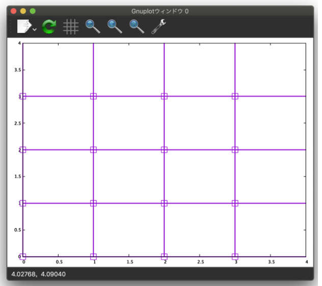

DSQSS/DLA のスタンダードモードによる反強磁性ハイゼンベルグダイマーの模型や格子の定義
===============================================================

このチュートリアルでは, :math:`S=1/2` 反強磁性ハイゼンベルグダイマーに外部磁場が印加されている系 :math:`\mathcal{H}= \sum_{\langle i,j \rangle}-J_z S^z_i S^z_j -\frac{J_{xy}}{2}(S^+_i S^-_j +S^-_i S^+_j)-h\sum_i S^z_i ,~J_z<0, J_xy<0, h>0` の格子の概形を計算をすることで,
DSQSS/DLA のスタンダードモード使い方を学びます.

DSQSS/DLA のスタンダードモードによる計算は,

1. シンプルモードの入力ファイルの準備
2. スタンダードモードの入力ファイルの作成
3. 計算の実行

の3段階に分かれます.

シンプルモードの入力ファイルの準備
********************

DSQSS/DLA を実行するには,

#. ハミルトニアンの情報
#. 格子の情報
#. 逆温度やモンテカルロステップ数などのパラメータの情報

を指定したTOML形式のシンプルモードファイル std.tomlが必要です.
そのため, まずはこの入力ファイルを準備します.
反強磁性ハイゼンベルグダイマーのファイルは以下の場所に用意されています
(sample/dla/01_spindimer/std.toml)
::

   [hamiltonian]
   model = "spin"
   M =  1                 # S=1/2
   Jz = -1.0              # coupling constant, negative for AF
   Jxy = -1.0             # coupling constant, negative for AF
   h = 0.0                # magnetic field
   [lattice]
   lattice = "hypercubic" # hypercubic, periodic
   dim = 1                # dimension
   L = 2                  # number of sites along each direction
   bc = false             # open boundary
   [parameter]
   beta = 100             # inverse temperature
   nset = 5               # set of Monte Carlo sweeps
   npre = 10              # MCSteps to estimate hyperparameter
   ntherm = 10            # MCSweeps for thermalization
   nmcs = 100             # MCSweeps for measurement
   seed = 31415           # seed of RNG

このファイルにz方向の外部磁場の印加の効果を付け加え, 格子の次元とサイトの数をそれぞれ2と4にします
::

   [hamiltonian]
   model = "spin"
   M =  1                 # S=1/2
   Jz = -1.0              # coupling constant, negative for AF
   Jxy = -1.0             # coupling constant, negative for AF
   h = 0.5                # magnetic field
   [lattice]
   lattice = "hypercubic" # hypercubic, periodic
   dim = 2                # dimension
   L = 4                  # number of sites along each direction
   bc = false             # open boundary
   [parameter]
   beta = 100             # inverse temperature
   nset = 5               # set of Monte Carlo sweeps
   npre = 10              # MCSteps to estimate hyperparameter
   ntherm = 10            # MCSweeps for thermalization
   nmcs = 100             # MCSweeps for measurement
   seed = 31415           # seed of RNG
   

スタンダードモードの入力ファイルの作成
**********

このファイルを dla_hamgen に与えます.
::

  $ dla_hamgen std.toml

この結果, サイトハミルトニアンや多体相互作用の情報を記述するTOML形式のテキストファイル hamiltonian.toml が生成されます.

次に, std.toml を dla_latgen に与えます.
::

  $ dla_latgen -t lattice.toml std.toml

この結果, ユニットセルと基本並進ベクトルを用いて空間の情報を記述するTOML形式のテキストファイルlattice.toml が生成されます.

計算の実行
****************

lattice.toml を入力ファイルとして, gnuplotファイル lattice.pltを作成できます::
::

  $ dla_latgen -g lattice.plt lattice.toml

lattce.plt を gnuplot に与えると2次元の格子の概形が得られます::

  z方向の外部磁場中の反強磁性ハイゼンベルグスピン鎖の格子の概形.
  
  
  
lattice.datとkpoints.datの作成
********************

lattice.tomlファイルでは格子の情報をユニットセルと基本並進ベクトルを用いて定義しました。一方, lattice.datファイルは格子の情報をサイトの数やサイト間の相互作用を用いて定義します。lattice.datもTOML形式のシンプルモードファイル std.tomlを用いて作成できます。
上で用いたz方向の外部磁場の印加の効果が入っているstd.tomlを dla_latgen に与えます.
::

  $ dla_latgen -o lattice.dat std.toml 

この結果, 以下のようなlattice.datファイルが得られます
::

   name
   hypercubic

lattice
2 # dim
4 4 # size
0 0 # 0:open boundary, 1:periodic boundary
0 1.0 0.0 # latvec_0
1 0.0 1.0 # latvec_1

directions
2 # ndirections
# id, coords...
0 1.0 0.0 
1 0.0 1.0 

sites
16 # nsites
# id, type, coord...
0 0 0.0 0.0
1 0 1.0 0.0
2 0 2.0 0.0
3 0 3.0 0.0
4 0 0.0 1.0
5 0 1.0 1.0
6 0 2.0 1.0
7 0 3.0 1.0
8 0 0.0 2.0
9 0 1.0 2.0
10 0 2.0 2.0
11 0 3.0 2.0
12 0 0.0 3.0
13 0 1.0 3.0
14 0 2.0 3.0
15 0 3.0 3.0

interactions
24 # nints
# id, type, nbody, sites..., edge_flag, direction
0 0 2 0 1 0 0
1 0 2 0 4 0 1
2 1 2 1 2 0 0
3 2 2 1 5 0 1
4 3 2 2 3 0 0
5 2 2 2 6 0 1
6 0 2 3 7 0 1
7 2 2 4 5 0 0
8 1 2 4 8 0 1
9 4 2 5 6 0 0
10 4 2 5 9 0 1
11 5 2 6 7 0 0
12 4 2 6 10 0 1
13 1 2 7 11 0 1
14 2 2 8 9 0 0
15 3 2 8 12 0 1
16 4 2 9 10 0 0
17 5 2 9 13 0 1
18 5 2 10 11 0 0
19 5 2 10 14 0 1
20 3 2 11 15 0 1
21 0 2 12 13 0 0
22 1 2 13 14 0 0
23 3 2 14 15 0 0
   

  
  
  
  

